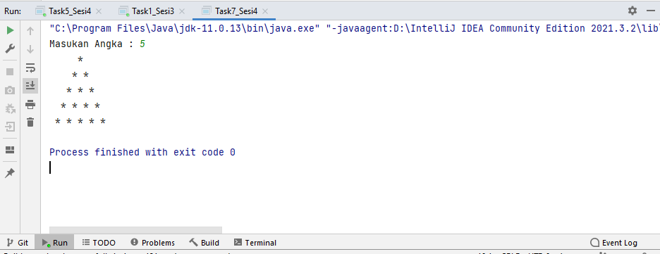

## 4_Basic Programming
## Resume
- Basic Programming
- Type Data & Variable Declaration
- Data Primitif & Non primitf
## Basic Programming
- Operator
- Type Data
- Branching
- Looping
- Input Output
- Operator
## Contoh Data Primitif
- btye
- short
- int
- long
- float
- double
- char 
- boolean
## Contoh Data Bukan Primitif
- Btye
- Short
- Integer
- Long
- Float
- Double
- Chacater
- Boolean
## Task
Task 1
- 
Task 3
- 
Task 4
- 
Task 5
- 
Task 6
- 
Task 7
- 
Task 8
- 
